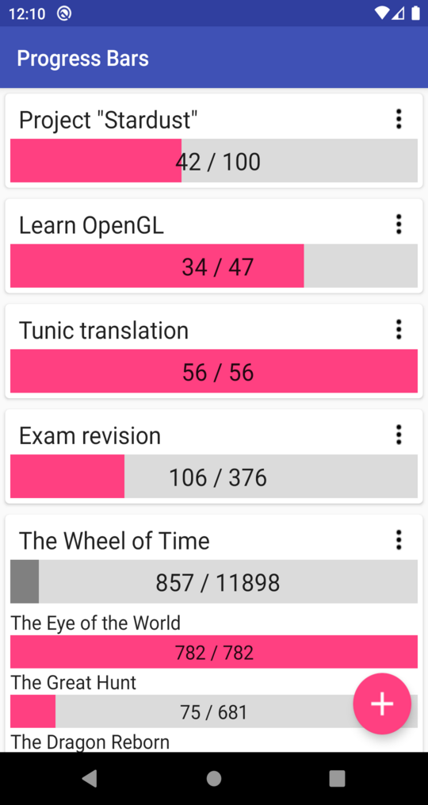

= Progress Bars

A simple Android goal tracker.

== What it is

An easy way to see the progress of your many projects at a glance, and an easy
way to adjust their state: just swipe the progress bar.

== What it _isn't_

- not a habit builder: no notifications, no daily tasks;
- not a motivation app: it will not track how often you check in, or how much
  progress you've made day-to-day;
- not a planner: no calendar integration, no task breakdown.
